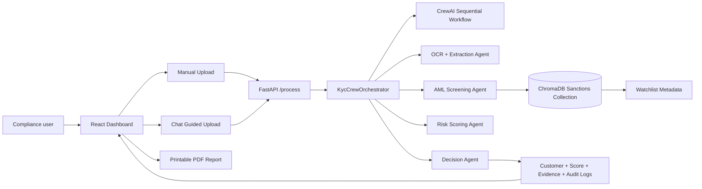

# AMD KYC AI Architecture

## Components

- React dashboard: Manual upload, chat-guided intake, KYC review dashboard, PDF export.
- FastAPI backend: Receives documents and returns structured KYC review results.
- KycCrewOrchestrator: Coordinates extraction, AML screening, scoring, decisioning, and audit logs.
- ChromaDB: Stores sanctions/watchlist documents with metadata such as entity type, risk category, source, and country.
- Audit logs: Returned from the backend for each processed document and shown in the dashboard/PDF.
